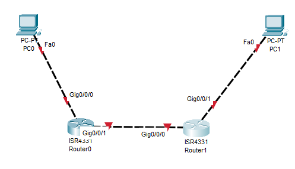
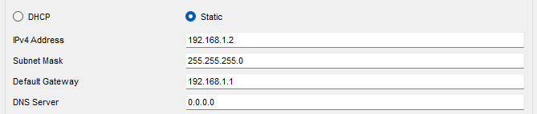
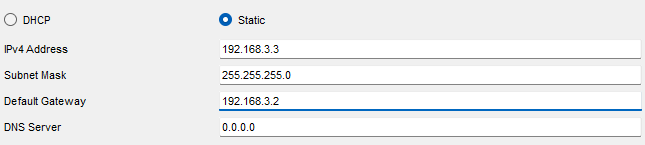
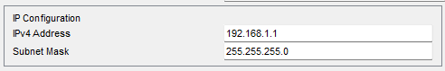
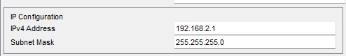
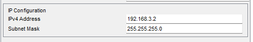
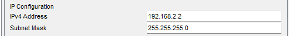
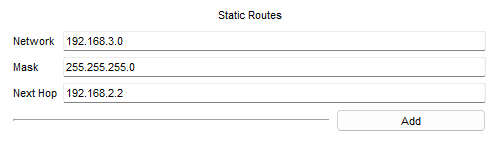
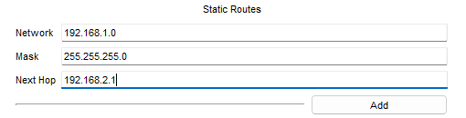
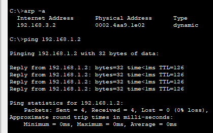

# Praktikum Komputer Jaringan

## Percobaan Menghubungkan Dua Perangkat Dengan Router

### 1. Topologi Jaringan

Terdapat dua PC yang terhubung melalui dua router

Kita buat topologi jaringan seperti gambar di atas.

### 2. Setting IP

- IP pada PC0

- IP pada PC1

- IP pada Router0 port0

- IP pada Router0 port1

- IP pada Router1 port0

- IP pada Router1 port1

### Tabel Routing Static

- Tabel routing static pada router0

Menghubungkan router0 pada jaringan 1 melalui router1 port1

- Tabel routing static pada router1

Menghubungkan router1 pada jaringa 3 melalui router0 port0

### 3. Percobaan PING

- Cek ARP cache

ARP belum menyimpan MAC Address PC1

- Dari PC0, ping PC1

Terjadi RTO dua kali, yang kemudian koneksi terhubung dan berhasil melakukan ping.

- Dari PC1, ping PC0 (Setelah ping pertama)

ARP telah disimpan, dan ketika ping tidak ada RTO sama sekali.
