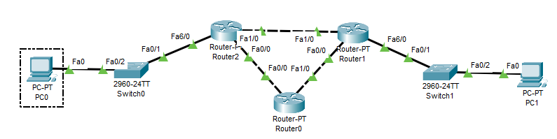
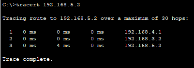
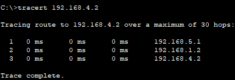
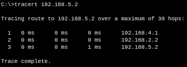
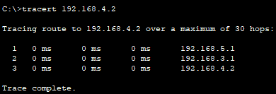

# Praktek Traceroute dan TTL

## 1. Topologi

Jenis router yang digunakan adalah Router-PT dengan port Fa tambahan.

## 2. Konfigurasi IP PC

|  Devices 	| Interface 	|      IP     	|
|:--------:	|:---------:	|:-----------:	|
|    PC0   	|   Fa0/0   	| 192.168.4.2 	|
|    PC1   	|   Fa0/0   	| 192.168.5.2 	|

## 3. Konfigurasi IP Router
|  Devices 	| Interface 	|      IP     	|
|:--------:	|:---------:	|:-----------:	|
| Router 0 	|   Fa0/0   	| 192.168.2.2 	|
|          	|   Fa1/0   	| 192.168.1.2 	|
| Router 1 	|   Fa0/0   	| 192.168.1.1 	|
|          	|   Fa1/0   	| 192.168.3.2 	|
|           |   Fa0/6   	| 192.168.5.1   |
| Router 2 	|   Fa0/0   	| 192.168.2.1 	|
|          	|   Fa1/0   	| 192.168.3.1 	|
|           |   Fa6/0   	| 192.168.4.1   |

## 4. Konfigurasi Static Routing Router
|  Devices 	| Destination Network 	|    Netmask    	|     Via     	|    Metric    	|
|:--------:	|:-------------------:	|:-------------:	|:-----------:	|:------------:	|
| Router 0 	|     192.168.4.0     	| 255.255.255.0 	| 192.168.2.1 	| 10 (Default) 	|
|          	|     192.168.5.0     	| 255.255.255.0 	| 192.168.1.1 	| 10 (Default) 	|
| Router 1 	|     192.168.4.0     	| 255.255.255.0 	| 192.168.3.1 	| 10 (Default) 	|
|          	|     192.168.2.0     	| 255.255.255.0 	| 192.168.1.2 	| 10 (Default) 	|
| Router 2 	|     192.168.5.0     	| 255.255.255.0 	| 192.168.3.1 	| 10 (Default) 	|
|          	|     192.168.1.0     	| 255.255.255.0 	| 192.168.2.2 	| 10 (Default) 	|

## 5. Percobaan Traceroute

### PC0 ke PC1

Dapat dilihat traceroute melalui router 2 (192.168.4.1), lalu ke router 1 (192.168.3.2), terakhir ke PC1 (192.168.5.2).

### PC1 ke PC0

Melalui router 1 (192.168.5.1), lalu ke router 2 (192.168.3.1), terakhir ke PC0 (192.168.4.2).

## 6. Mengubah Metric Static Routing
Pada saat Routing, router akan memilih jalur dengan metric paling kecil. Disini akan dirubah metric-nya untuk mempengaruhi jalur routing.

|  Devices 	| Destination Network 	|    Netmask    	|     Via     	|    Metric    	|
|:--------:	|:-------------------:	|:-------------:	|:-----------:	|:------------:	|
| Router 0 	|     192.168.4.0     	| 255.255.255.0 	| 192.168.2.1 	| 10 (Default) 	|
|          	|     192.168.5.0     	| 255.255.255.0 	| 192.168.1.1 	| 10 (Default) 	|
| Router 1 	|     192.168.4.0     	| 255.255.255.0 	| 192.168.3.1 	| 10 (Default) 	|
|          	|     192.168.2.0     	| 255.255.255.0 	| 192.168.1.2 	| 10 (Default) 	|
|          	|     192.168.4.0     	| 255.255.255.0 	| 192.168.1.2 	|       1      	|
| Router 2 	|     192.168.5.0     	| 255.255.255.0 	| 192.168.3.2 	| 10 (Default) 	|
|          	|     192.168.1.0     	| 255.255.255.0 	| 192.168.2.2 	| 10 (Default) 	|
|          	|     192.168.5.0     	| 255.255.255.0 	| 192.168.2.2 	|       1      	|

### PC0 ke PC1

Melalui router 2 (192.168.4.1), lalu ke router 0 (192.168.2.2), terakhir ke pc1 (192.168.5.2).

### PC1 ke PC0

Melalui router 1 (102.168.5.1) lalu ke router 0 (192.168.1.2) dan akhirnya ke pc0 (192.168.4.2).

Jalur routing berbeda dengan sebelumnya. Itu karena adanya jalur yang lebih efisien dari sebelumnya.
