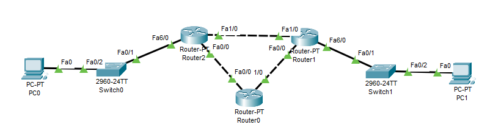
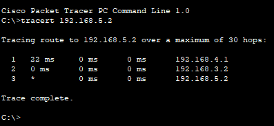
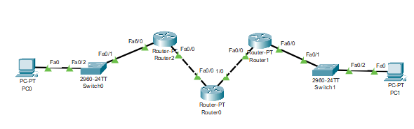
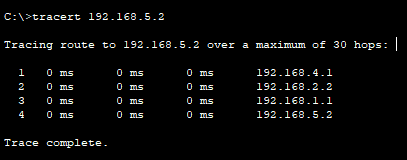

# Dynamic Routing dengan Protocol RIPv2

## Topologi

## Konfigurasi IP Router

| Devices  | Interface |     IP      |
| :------: | :-------: | :---------: |
| Router 0 |   Fa0/0   | 192.168.2.2 |
|          |   Fa0/1   | 192.168.1.2 |
| Router 1 |   Fa0/0   | 192.168.1.1 |
|          |   Fa0/1   | 192.168.3.2 |
|          |   Fa0/2   | 192.168.4.1 |
| Router 2 |   Fa0/0   | 192.168.2.1 |
|          |   Fa0/1   | 192.168.3.1 |
|          |   Fa0/2   | 192.168.5.1 |
|   PC0    |   Fa0/0   | 192.168.4.2 |
|   PC1    |   Fa0/0   | 192.168.5.2 |

## Konfigurasi Routing (RIPv2)

| Devices  |   Network   |
| :------: | :---------: |
| Router 0 | 192.168.1.0 |
|          | 192.168.2.0 |
| Router 1 | 192.168.1.0 |
|          | 192.168.3.0 |
|          | 192.168.5.0 |
| Router 2 | 192.168.2.0 |
|          | 192.168.3.0 |
|          | 192.168.4.0 |

## Test 1

Dapat dilihat jalur rute yang dilalui packet, adalah sebagai berikut :

- PC0 mengirimkan packet ke Router1.
- Router2 menerima packet, mengirimkan packet ke Router1.
- Router2 menerima packet. mengirimkan packet ke PC1.
- PC1 menerima packet.

## Testing 2

Topologi baru memutus hubungan langsung antara router2 dan router1.

Dapat dilihat jalur rute yang dilalui packet, adalah sebagai berikut :

- PC0 mengirimkan packet ke router2.
- Router2 menerima packet, mengirimkan packet ke router0.
- Router0 menerima packet, mengirimkan packet ke router1.
- Router1 menerima packet, mengirimkan packet ke PC1.
- PC1 menerima packet.

# Kesimpulan

Dari percobaan tersebut, dapat diambil jikalau dynamic routing lebih mudah diimplementasikan dan fleksible akan perubahan (tanpa harus mengubah routing table). Berbeda dengan static routing yang harus dikonfigurasi secara manual setiap kali. 
